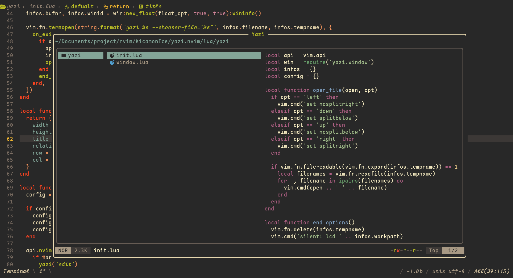

# yazi.nvim
Yazi lightweight plugin for neovim

### Screenshot


### Dependencies: [yazi](https://github.com/sxyazi/yazi)

### Install
**lazy.nvim**

```lua
{
  "Kicamon/yazi.nvim",
  lazy = true,
  cmd = "Yazi",
  config = function()
    require('yazi').setup()
  end
}
```

**vim-plug**

```vim
Plug "Kicamon/yazi.nvim", {['on'] = 'Yazi' }}
lua require('yazi').setup()
```

### command
| open         | description                       |
|--------------|-----------------------------------|
| `Yazi`       | Open files in buffers             |
| `Yazi tabe`  | Open files in tabs                |
| `Yazi left`  | Open the file in the left window  |
| `Yazi down`  | Open the file in the lower window |
| `Yazi up`    | Open the file in the top window   |
| `Yazi right` | Open the file in the right window |

### Configuration
defualt config
```lua
require('yazi').setup({
  width = 0.8,
  height = 0.8,
  position = 'cc',
})
```

#### position
```
+--------------+-------------------+---------------+
|              |                   |               |
|      tl      |                   |       tr      |
|              |                   |               |
+--------------+                   +---------------+
|                                                  |
|                 +-------------+                  |
|                 |             |                  |
|                 |     cc      |                  |
|                 |             |                  |
|                 +-------------+                  |
|                                                  |
+--------------+                   +---------------+
|              |                   |               |
|     bl       |                   |       br      |
|              |                   |               |
+--------------+-------------------+---------------+
```

### License MIT
